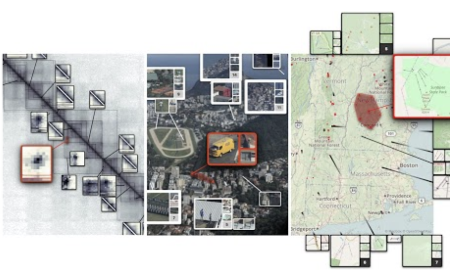
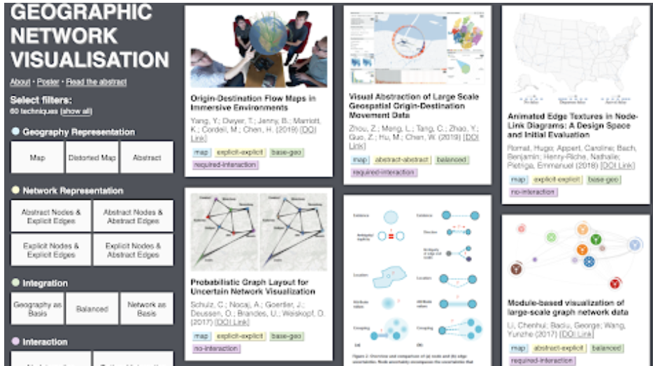
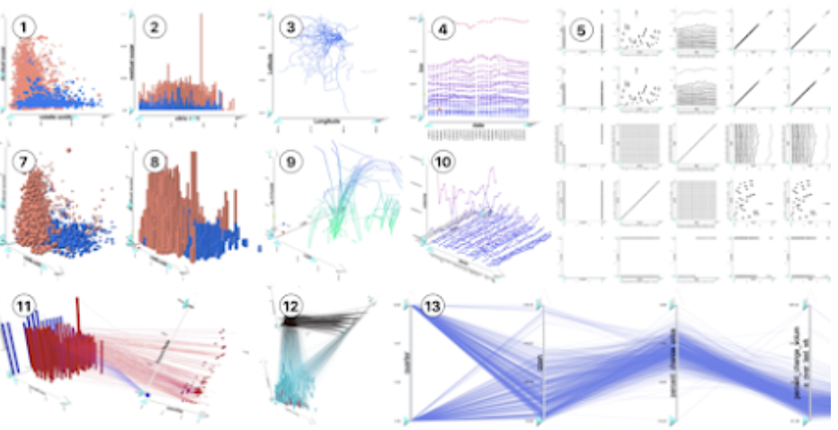
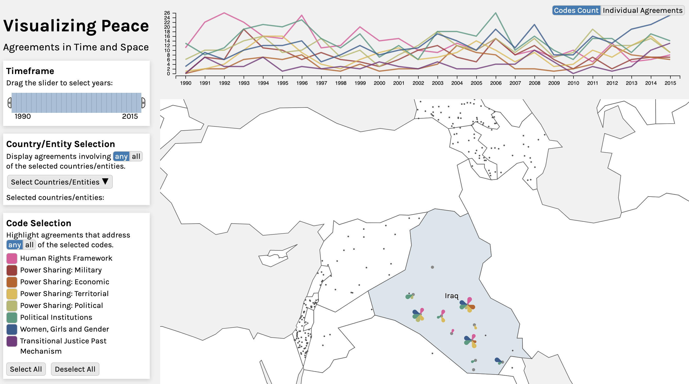
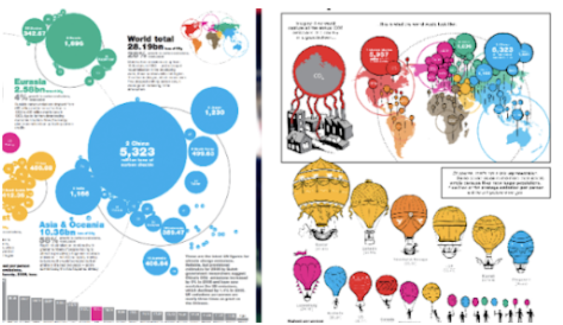
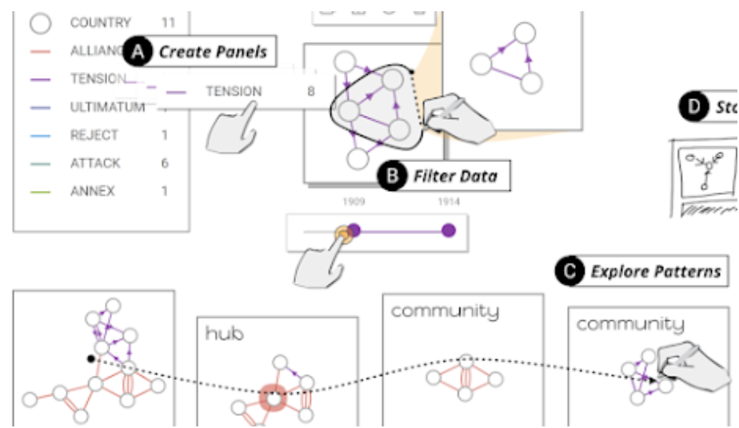
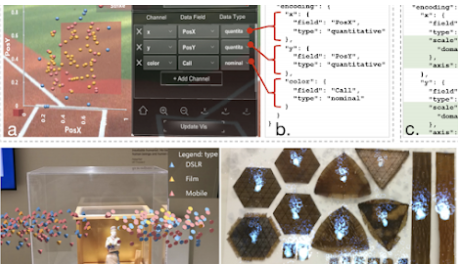

<a href="#contact">Contact</a> |
<a href="#research-interests">Reserach Interests</a> |
<a href="#hort-bio">Short Bio</a> |
<a href="publications.html">Publications</a> |
<a href="#awards">Awards</a> |
<a href="#professional-activties">Professional Activities</a> |
<a href="#reviewing">Reviewing</a> |
<a href="#invited-talks">Invited Talks</a> |
<a href="#scientific-workshops">Scientific Workshops</a> |
<a href="#teaching">Teaching</a> |
<a href="#grants">Grants</a>

# Benjamin Bach

Benjamin is a Lecturer (Assistant Prof.) in Design Informatics and Visualization at the University of Edinburgh. His research designs and investigates interactive information visualization interfaces to help people explore, communicate, and understand data across media such as screens, mixed reality, paper, and physicalizations.

## Contact
**Office:** [Informatics Forum (IF 4.30), 10 Crichton St, Edinburgh](https://www.google.com/maps/place/10+Crichton+St,+Edinburgh+EH8+9AB,+UK/data=!4m2!3m1!1s0x4887c78381f1372f:0x8f0142034b156141?sa=X&ved=2ahUKEwjljc_o9NnmAhVj7nMBHX0QBJAQ8gEwAHoECAsQAQ)

**Email:** [bbach@inf.ed.ac.uk](mailtp:bbach@inf.ed.ac.uk)

**Twitter:** [@benjbach](https://twitter.com/benjbach)

<i style="color:#b00;">We are searching for new [Chair in Design Informatics](https://www.ed.ac.uk/informatics/news-events/stories/2019/informatics-searching-for-new-chair-design-inf)!</i>

## Research Interest

* Network Visualization
* Visualization of spatio-temporal data
* Data-driven storytelling
* Visualization in Augmented and Virtual Reality (Immersive Analytics)
* Non-digital visualization
* Teaching and learning visualization

## Short Bio

Before joining the University of Edinburgh in 2017, Benjamin worked as a postdoc at Harvard University ([Visual Computing Group](https://www.google.com/url?q=https%3A%2F%2Fvcg.seas.harvard.edu%2F&sa=D&sntz=1&usg=AFQjCNHrOk6QL6lA3f7dQ3s5JLepEn9MiA)), [Monash University](https://ialab.it.monash.edu/), as well as the [Microsoft-Research Inria Joint Centre](https://www.google.com/url?q=https%3A%2F%2Fwww.inria.fr%2Fen%2Fcontent%2Fview%2Ffull%2F4829&sa=D&sntz=1&usg=AFQjCNGBfXkOUQap4XpJvpznhGybg2rRdA). Benjamin was visiting researcher at the University of Washington and Microsoft Research in 2015. He obtained his PhD in 2014 from the Université Paris Sud where he worked at the Aviz Group at Inria. The PhD thesis entitled [Connections, Changes, and Cubes: Unfolding Dynamic Networks for Visual Exploration](https://drive.google.com/file/d/1X3Ockv7Nn3D6x-8BQOeM0rw4ebcySvrL/view?usp=sharing) got awarded an honorable mention as the Best Thesis by the IEEE Visualization Committee. In 2019, Benjamin got awarded the [Eurographics Young Researcher Award](https://www.google.com/url?q=https%3A%2F%2Fwww.eg.org%2Fwp%2Feurographics-awards-programme%2Fthe-young-researcher-award%2F&sa=D&sntz=1&usg=AFQjCNGLooUCw7B6d4RvS-VgDruG9qrC8w) (thanks to all my mentors and collaborators, this is your award!).

## Publications 

[Publications](publications.html)
[Google Scholar](https://scholar.google.com/citations?hl=en&user=dXbz4FgAAAAJ)

### Recent Publications

## 2020

**[Pattern-Driven Navigation in 2D Multiscale Visualizations with Scalable Insets](https://vcg.seas.harvard.edu/publications/pattern-driven-navigation-in-2d-multiscale-visualizations-with-scalable-insets)**
Fritz Lekschas, Michael Behrisch, Benjamin Bach, Peter Kerpedjiev, Nils Gehlenborg, Hanspeter Pfister, *IEEE Transactions on Visualization and Computer Graphics (TVCG) 2020 (IEEE VIS, 2019))*  

## 2019

**[Geographic Network Visualization Techniques: A Work-In-Progress Taxonomy](https://www.google.com/url?q=https%3A%2F%2Fgeographic-networks.github.io%2Fabstract.pdf&sa=D&sntz=1&usg=AFQjCNE14-21ZgF1E9MSvOJI2LrMlgSNIg)**
Sarah Schöttler, Tobias Kauer, Benjamin Bach: *Poster at Graph Drawing, (2019)*

[Weblink](https://geographic-networks.github.io)

**[IATK: An Immersive Analytics Toolkit](https://hal-enac.archives-ouvertes.fr/hal-02288638/file/IATK_IEEE_VR.pdf)**
Maxime Cordeil, Andrew Cunningham, Benjamin Bach, Christophe Hurter, Bruce H. Thomas, Kim Mariott, Tim Dwyer, IEEE VR (2019)  

[Weblink](https://research.monash.edu/en/publications/iatk-an-immersive-analytics-toolkit)

**[PaxVis: Visualizing Peace Agreements](papers/havens2019paxvis.pdf)**
Lucy Havens, Mengting Bao, Larissa Pschetz, Benjamin Bach, Christine Bell. 
*ACM Conference on Human Factors in Computing Systems (CHI) (2019).*

[Weblink](https://sarah37.github.io/pax/timeandspace)

**[Comparing Effectiveness and Engagement of Data Comics and Infographics](https://www.researchgate.net/profile/Benjamin_Bach2/publication/331357753_Comparing_Effectiveness_and_Engagement_of_Data_Comics_and_Infographics/links/5cb859aaa6fdcc1d499cc3b1/Comparing-Effectiveness-and-Engagement-of-Data-Comics-and-Infographics.pdf)**
Zezong Wang, Shunming Wang, Matteo Farinella, Dave Murray-Rust, Nathalie Henry Riche.  *ACM Conference on Human Factors in Computing Systems (CHI)  (2019).*

**[DataToon: Drawing Data Comics About DynamicNetworks with Pen + Touch Interaction](https://www.researchgate.net/profile/Benjamin_Bach2/publication/332231214_DataToon_Drawing_Data_Comics_About_Dynamic_Networks_with_Pen_Touch_Interaction/links/5ca78456299bf118c4b57dd7/DataToon-Drawing-Data-Comics-About-Dynamic-Networks-with-Pen-Touch-Interaction.pdf)**
Nam Wook Kim, Nathalie Henry Riche, Benjamin Bach, Guanpeng Xu, Matthew Brehmer, Ken Hinckley, Michel Pahud, Haijun Xia, Michael J. McGuffin, Hanspeter Pfister. *ACM Conference on Human Factors in Computing Systems (CHI) (2019).*

**[Teaching Data Visualization and Storytelling with Data Comic Workshops](papers/wang2019teaching.pdf)**
Zezhong Wang, Harvey Dingwal, Benjamin Bach.  ACM Conference on Human Factors in Computing Systems (CHI), Extended Abstracts (2019).

**[DXR: A Toolkit for Building Immersive Data Visualizations](papers/sicat2019dxr.pdf)**
Sicat, Ronell, Jiabao Li, JunYoung Choi, Maxime Cordeil, Won-Ki Jeong, Benjamin Bach, and Hanspeter Pfister. *IEEE transactions on visualization and computer graphics (2019) (IEEE VIS 2018).*

## Awards

* 2019 Eurographics Young Researcher Award.
* 2018 BioVis Best Poster Award: Feature Centric Visual Exploration of Genomic Interaction Matrices
* 2014 VGTC Best Ph.D. Thesis 2014, Honorable Mention
* 2013 IEEE VIS Best Poster Award: Visualizing Dense Dynamic Networks with Matrix Cubes
* 2013 ACH CHI Best Paper Award: Weighted graph comparison techniques for brain connectivity analysis

## Professional Activities

* ACM ISS Workshop Chair (2020)
* ACM CHI Paper Associate Chair (2018, 2019)
* ACM CHI Late Braking Work Associate Chair (2017)
* ACM CHI Work-in-Progress Program Committee (2015)
* IEEE InfoVis Program Committee (2018)
* IEEE VAST Program Committee (2018)
* GraphDrawing Program Committee
* TransImage Conference: Conference Co-chair 2018

## Reviewing (selection)

* ACM CHI: since 2013
* IEEE InfoVis/Vast: since 2012
* TVCG: since 2011
* EuroVis: since 2012
* Graph Drawing

## Recent Invited Talks

(Not including conference presentations)

* January 2020: [Dealing vis Data](pdfs/dealing_vis_data_keynote.pdf): Keynote to Dealing with Data conference, Edinburgh  
* June 2019: Visualizing Peace and Conflicts, Edinburgh Futures Seminar, University of Edinburgh 
* May 2019: Data visualization for exploration, explanation and beyond, Kings College, London.
* December 2018: Visualizing Space-Time Cubes in AR, Shonan Seminar to Immersive Analytics, Tokio.
* October 2018: Interactive Visualization for Dynamic, Multivariate, and Geographic Networks, Tuto@Mate (online webinar)
* September 2018: Data Comics for Data-Driven Storytelling, University of Tilburg, Netherlands
* September 2018: Perspectives on Data Visualization, Design Informatics Seminar Series, University of Edinburgh.
* May 2018: Interaction Literacy for Data Visualization, Workshop on Big Data Analytics and Business Applications, AVI Conference, Casteglione della Pescaia, Italy
* May 2018: Data Visualization for Exploration, Explanation, and Engagement, Tesco Bank, Edinburgh
* May 2918: Drawing into the AR-Canvas: Designing Embedded Visualizations for Augmented Reliaty., OpenVis Conference, Paris
* March 2018: Visualization for Interactive Data Exploration, Alan Turing Institute, London
* February 2018: Seven Myths about Data Visualization, Controversies in the Data Society Talk Series, Edinburgh
* ... 

## Scientific Workshops

* **[Envisioning Future Productivity for Immersive Analytics](http://immersiveanalytics.io/)**: Barrett Ens,
Benjamin Bach, Maxime Cordeil, Ulrich Engelke, Marcos Serrano, Wesley Willett
* **Interactive Visualization of Dynamic Multivariate Networks with the Vistorian:Benjamin Bach, Workshop at The Connected Past**, University of Oxford, 2018
* **[VisGuides: 2nd Workshop on the Creation, Curation, Critique and Conditioning of Principles and Guidelines in Visualization](http://www.google.com/url?q=http%3A%2F%2Fworkshop.visguides.org%2F&sa=D&sntz=1&usg=AFQjCNGaxxHnV84G4rnAPHCAfDY1cFuvbQ**): Alexandra Diehl, Benjamin Bach, Alfie Abdul-Rahman, IEEE VIS 2018, Berlin
* **Storyboards for Science: Combining the Visual and Verbal to Create Engaging Communication**: David Rogers, Francesca Samsel, Sean Cunningham, Benjamin Bach, IEEE VIS 2018, Berlin
* **Interactive Visualization of Dynamic Multivariate Networks with the Vistorian**: Benjamin Bach, Jean-Daniel Fekete, Nicole Dufournaud, Open workshop, EHESS, Paris, 2018
* **Interactive Visualization of Dynamic Multivariate Networks with the Vistorian:Benjamin Bach**, Workshop at CAA conference, University of Tübingen, 2018
* **Immersive Analytics: Exploring Future Visualization and Interaction Technologies for Data Analytics**: Benjamin Bach, Maxime Cordeil, Tim Dwyer, Bongshin Lee, Bahador Saket, Alex Endert, Christopher Collins, Sheelagh Carpendale, IEEE VIS 2017 Phoenix, AZ
* **Discovery Jam**: David Rogers, Dan Keefe, Francesca Samsel, Miriah Meyer, Cecilia Aragon, Benjamin Bach: IEEE VIS 2017, Phoenix, AZ
* **Interactive Visualization of Dynamic Multivariate Networks with the Vistorian**: Benjamin Bach, Workshop at The Connected Past, University of Bournemouth, 2017
* **Immersive Analytics**: Exploring Future Interaction and Visualization Technologies for Data Analytics: B Bach, R Dachselt, S Carpendale, T Dwyer, C Collins, B Lee. Proceedings of the 2016 ACM on Interactive Surfaces and Spaces, 529-533
 
## Teaching 

### Ongoing
* **Data Science for Design**, semester 1 (postgraduate)
* [**Data Visualisation**](https://datavis2020.github.io), semester 2 (postgraduate)

### Past
* **The Human Factor**

## Research Grants
* 2019 Scottish Founding Council (SCF): Data Visualization Online Course for Upskilling, £80,000
* 2019 Global Challenges Research Fund (GCRF): Peacetech Initiative: partnership for interactive mediation, £46,000
* 2018 EPSRC Capital Grant: VisHub: A Collaborative Data Visualization Space for Interdisciplinary Research, Teaching, and Public Engagement, £200,000
* 2018 Edinburgh Futures Institute Research Grant: Visualizing Inequalities £8,000
* 2017 IGS (School internal) PhD scholarship funding: ~£60,000
* 2017 Principal’s Teaching Award: £15,000
* 2014 Microsoft Research – Inria Joint Centre 18 month position
* 2010-2014 French Government Ph.D. grant: $100.000, over 3 years
