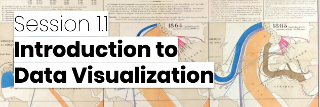

__Visual<b style="color:red;">+</b>Interactive Data__ group is researching interactive, exploratory and explanatory visualizations across environments such as screen, tangible, and immersion to support interdisciplinary research to understand and communicate complex data. _Visual+Interactive Data_ is based at the [Institute for Design Informatics](https://www.designinformatics.org/) and the [School of Informatics](https://www.ed.ac.uk/informatics) at the [University of Edinburgh](https://www.ed.ac.uk). Our research includes, but is not limited to areas in 

* network and spatio-temporal visualization, 
* data-driven storytelling, 
* visualization in augmented and virtual reality (Immersive Analytics), 
* non-digital and physical visualization, and 
* teaching and learning visualization. 

Visual<b style="color:red;">+</b>Interactive Data is heavily involved in co-organizing [Edinburgh's Data Vis Meetup](https://www.meetup.com/meetup-group-vBHbCmgh). [Get in touch with us](mailto:bbach@ed.ac.uk) if you want to become involved.

# News 
* *Oct 2020:* [IEEE VIS Workshop on Visualizatino Education: Vis Actitivies](http://visactivities.github.io).
* *June 2020:* [Online data visualization course for professionals](https://datavis-online.github.io) starts on June 15.
* *June 2020:* Two [papers](publications.html) accepted at [AVI 2020](https://sites.google.com/unisa.it/avi2020/home)!
<!--* *June 2020:* Devanjan Bhattacharya joins as a post-doc, working on map applications for peace analysis.
* *May 2020:* James Scott-Brown (postdoc) and Arran Ridley (research assistant) join the team!
-->

[More news...](news.html)

# Selected Projects ([more](publications.html))

### Online Course Data Visualization for Professionals

Running from June 15 to July 17. [https://datavis-online.github.io](https://datavis-online.github.io/)

### Data Visualization Cheat Sheets

Data Visualization Cheat Sheets are aimed at supporting learning and teaching of data visualization techinques and investigate ways to better teach data visualization in general. [http://visualizationcheatsheets.github.io](http://visualizationcheatsheets.github.io)

### Data Comics

Data Comicscombine visual language and narrative patterns from traditional comics to tell expressive stories with data and visaulization. We explore this exciting medium and develop workshops and guiding material. [http://datacomics.net](datacomics.net)  

### Immersive Anlytics

The **[Edinburgh VisHub](http://edinburghvishub.github.io)** is an university-wide lab for data visualization equipment to foster research, collaboration, learning, and outreach. **[DXR](https://sites.google.com/view/dxr-vis)** and **[IATK](https://github.com/MaximeCordeil/IATK)** are two toolkits for creating immersive data visualizations in augmented and virtual reality. Check how to participate in our [upcoming workshop at CHI 2020](http://immersiveanalytics.io). 

### The Vistorian: Network Visualization

The Vistorian is an Interactive Visualizations for Dynamic and Multivariate Networks. Free, online, and open source. More information on the Vistorian-blog. [http://vistorian.net](vistorian.net)

### Survey on Geographical Networks

[http://geographic-networks.github.io](http://geographic-networks.github.io)
