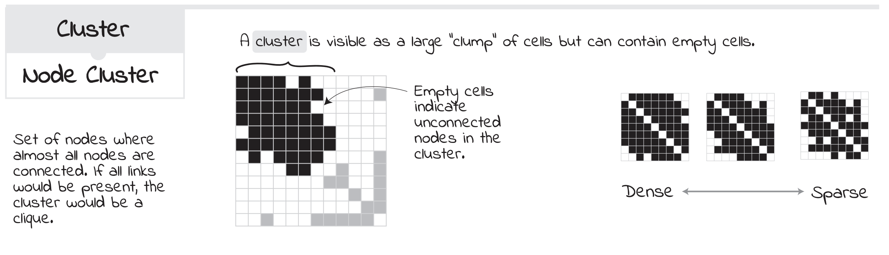
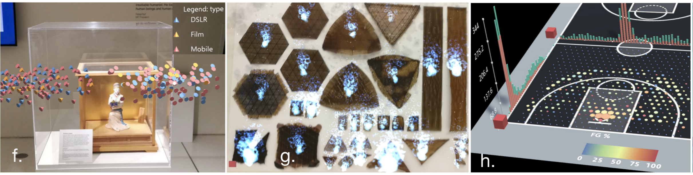
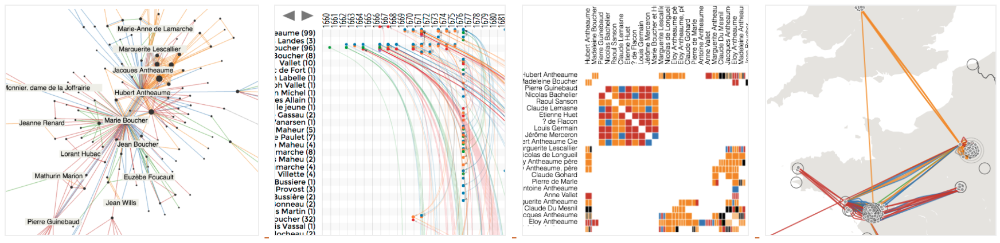

__Visual<b style="color:red;">+</b>Interactive Data__ group is researching interactive, exploratory and explanatory visualizations across environments such as screen, tangible, and immersion to support interdisciplinary research to understand and communicate complex data. _Visual+Interactive Data_ is based at the [Institute for Design Informatics](https://www.designinformatics.org/) and the [School of Informatics](https://www.ed.ac.uk/informatics) at the [University of Edinburgh](https://www.ed.ac.uk). Our research includes, but is not limited to areas in 

* network and spatio-temporal visualization, 
* data-driven storytelling, 
* visualization in augmented and virtual reality (Immersive Analytics), 
* non-digital and physical visualization, and 
* teaching and learning visualization. 

Visual<b style="color:red;">+</b>Interactive Data is heavily involved in co-organizing [Edinburgh's Data Vis Meetup](https://www.meetup.com/meetup-group-vBHbCmgh). [Get in touch with us](mailto:bbach@ed.ac.uk) if you want to become involved.

## Selected Projects ([more](publications.html))

**[Data Visualization Cheat Sheets](https://sites.google.com/view/datavisualizationcheatsheet)** are aimed at supporting learning and teaching of data visualization techinques and investigate ways to better teach data visualization in general.

**[Data Comics](Datacomics.net)** combine visual language and narrative patterns from traditional comics to tell expressive stories with data and visaulization. We explore this exciting medium and develop workshops and guiding material. 

The [Edinburgh VisHub](http://edinburghvishub.github.io/) is an university-wide lab for data visualization equipment to foster research, collaboration, learning, and outreach. **[DXR](https://sites.google.com/view/dxr-vis)** and **[IATK](https://github.com/MaximeCordeil/IATK)** are two toolkits for creating immersive data visualizations in augmented and virtual reality. Check how to participate in our [upcoming workshop at CHI 2020](http://immersiveanalytics.io). 

**[The Vistorian](Vistorian.net)** is an Interactive Visualizations for Dynamic and Multivariate Networks. Free, online, and open source. More information on the Vistorian-blog. 

**[Survey on Geographical Networks](http://geographic-networks.github.io/)**

## Joining Us

* **PhD:** Please [contact us](mailto:bbach@ed.ac.uk) directly. (Competitive) [Funding](phd-edinburgh.html) might be is available.
* **MSc dissertation:** [Check how to plan your project](project-planning.html) and [contact us](mailto:bbach@ed.ac.uk). Ideally, we combine your DI project and MSc to work on the same topic.
* **Research internships** are possible all year around. The University asks for a fee for more than 12. Funding might be available for selected projects.

