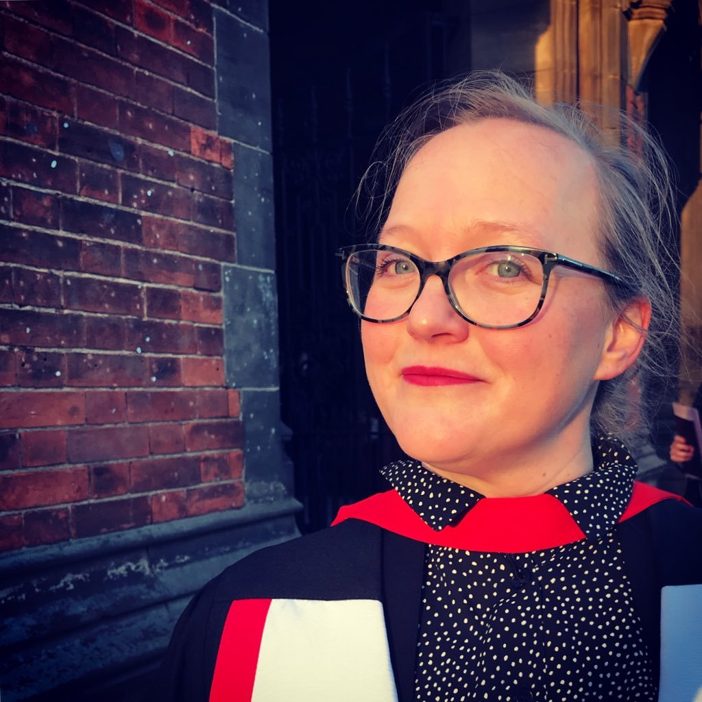

# People

<table>
  <tr>
    <td style="vertical-align:top;width:100px;"></td>
    <td style="vertical-align:top;">
      <b><a href="bach.html">Benjamin Bach</a></b>, Lecturer (Assistant Prof.) in Design Informatics and Visualization at the University of Edinburgh. His research designs and investigates interactive information visualization interfaces to help people explore, communicate, and understand data across media such as screens, mixed reality, paper, and physicalizations.
       
      <a href="https://scholar.google.com/citations?user=dXbz4FgAAAAJ&hl=en&oi=ao">Google Scholar</a>
    </td>
  </tr>

  <tr>
    <td style="vertical-align:top;width:100px;"></td>
    <td style="vertical-align:top;">
      <b><a href="http://data-things.com">Bettina Nissen</a></b>, Lecturer (Assistant Prof.) in Interaction Design and researcher in Design Informatics at the University of Edinburgh. With a background in product and interaction design, digital fabrication and data physicalisation, her practice-based research focuses on engaging audiences with complex technological concepts and data through tangible means and makings. Research through Design, Designing with Data, Data Engagement, Data Physicalisation, Digital Fabrication.
       
      <a href="https://scholar.google.com/citations?user=yv5H92AAAAAJ&hl=en&oi=ao">Google Scholar</a>
    </td>
  </tr>
  
  <tr>
    <td style="vertical-align:top;width:100px;"></td>
    <td style="vertical-align:top;">
      <b><a href="http://dave.murray-rust.org/">Dave Murray-Rust</a></b>, Lecturer and researcher and creative practitioner at the University of Edinburgh, working in human-algorithm interaction - exploring the messy terrain between people, data and things through a combination of making and thinking.
       
      <a href="https://scholar.google.com/citations?user=tncrPCIAAAAJ&hl=en&oi=ao">Google Scholar</a>
    </td>
  </tr>

<tr>
    <td style="vertical-align:top;width:100px;"></td>
    <td style="vertical-align:top;">
      <b><a href="http://entretags.de/">Larissa Pschetz</a></b>, interaction designer, researcher and lecturer at the University of Edinburgh. Research through design, Technology for social development, Internet of Things (IoT), Temporal design, Biodesign
       
      <a href="https://scholar.google.com/citations?user=tncrPCIAAAAJ&hl=en&oi=ao">Google Scholar</a>
    </td>
  </tr>

<tr>
   <td style="vertical-align:top;width:100px;"></td>
    <td style="vertical-align:top;">
      <b>Zezhong Wang</b>, PhD student working on <i>Methods for Creating and Teaching Data Comics</i>.
       
      <a href="https://www.google.com/url?q=https%3A%2F%2Fwww.designinformatics.org%2Fperson%2Fzezhong-wang%2F&sa=D&sntz=1&usg=AFQjCNHzUyBbeidHdj8inLnByMelDz7tjg">Personal website</a>
       
      <a href="https://scholar.google.com/citations?user=EJ8drhwAAAAJ&hl=en&oi=ao">Google Scholar</a>
    </td>
  </tr>
  
  <tr>
   <td style="vertical-align:top;width:100px;"></td>
    <td style="vertical-align:top;">
      <b>Tobias Kauer</b>, PhD student working on <i>Discursive Data Visualization</i>.
       
      <a href="https://twitter.com/tobi_vierzwo">Personal website</a>      
       
      <a href="https://scholar.google.com/citations?user=qDN6jW4AAAAJ&hl=en&oi=ao">Google Scholar</a>
    </td>
  </tr>
  
  <tr>
   <td style="vertical-align:top;width:100px;"></td>
    <td style="vertical-align:top;">
      <b>Mashael Hamad Alkadi</b>, PhD student working on <i>Learning Analytics</i>.
    </td>
  </tr>

  <tr>
   <td style="vertical-align:top;width:100px;"></td>
    <td style="vertical-align:top;">
      <b>John Harper-Lee</b> working on <i>Biological Data Analysis</i>.
       
      <a href="https://scholar.google.com/citations?user=qDN6jW4AAAAJ&hl=en&oi=ao">Google Scholar</a>
    </td>
  </tr>
  
  <tr>
   <td style="vertical-align:top;width:100px;"></td>
    <td style="vertical-align:top;">
      <b>Ryan Bowler</b>, informatics PhD student researching ways to understand and implement the complexities of human time within Human-Computer-Interactions.
       
    </td>
  </tr>
  
    <tr>
   <td style="vertical-align:top;width:100px;"></td>
    <td style="vertical-align:top;">
  <a href="https://www.tzingtao.com/"><b>Jingtao Zhou</b></a>, visiting students grom Tianjin University and working on data comics creation. 
       
    </td>
  </tr>
 
 
</table>

**Vebjørn Halvfjerdvik**  

# Alumni

## PhD Interns

[Zhutian Chen](https://chenzhutian.org/), Honkong University (2019)

## MRes 
Qiuyuan Ren (2018)

## Master
Finn Ickler (MSc, 2018), 
Xudong Jiang (MSc, 2018), 
Ilyas Zholdasbayev (MSc, 2018), 
Yiwei Sun (MSc, 2018), 
Yan Wu (MSc, 2018),
Iqbal Rosiadi (MSc, 2018), 
Edson Alcala (MSc, 2017), 
Parul Sharma (MSc , 2017), 
Ruobing Hao (MA, 2017), 
Xian Tang (MSc, 2017), 
Zezhong Wang (MSc, 2017).

## BHons
James O’Donell, 
Charles Shraples, 
Hirsh Agarwal; 
Alexander Olson, 
Veronika Dimitrova;

## Interns
Liwenhan Xie, Peking University (2019)
Armand Pons, Université de Lyon (2019)
Punpikorn Rannanawirojkul, University of Edinburgh (2018)
Shunming Wang, Peking University (2018)
