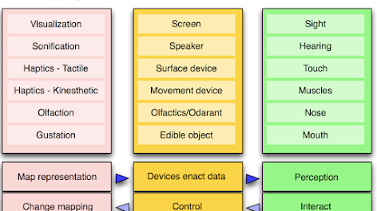
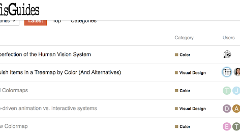
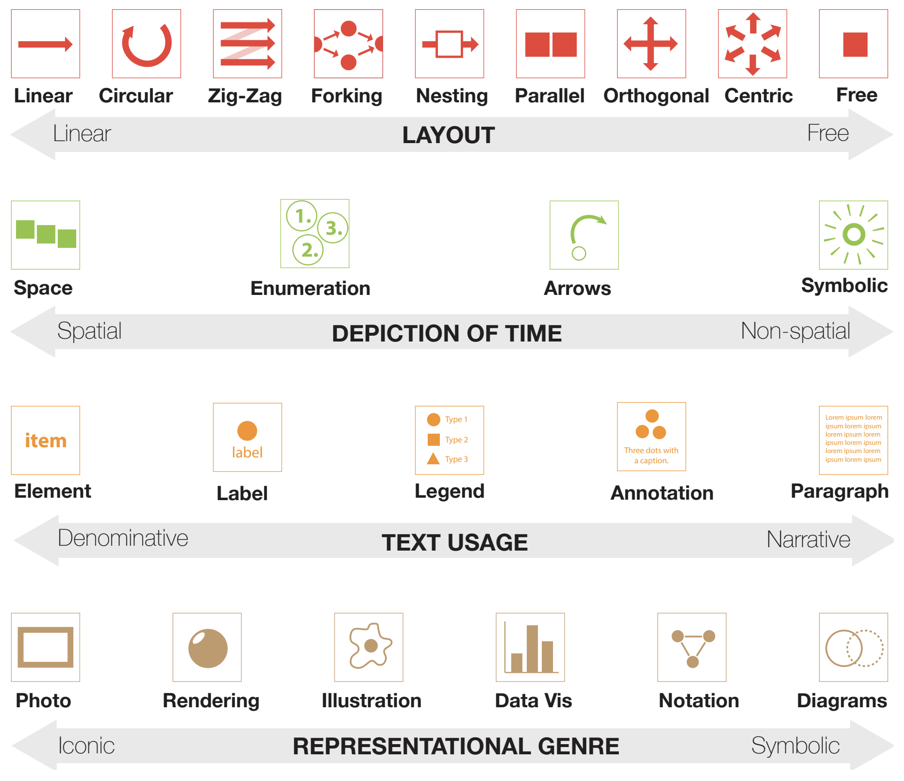
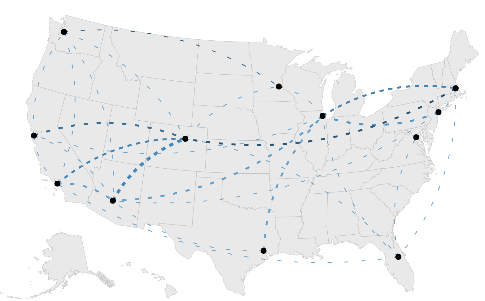
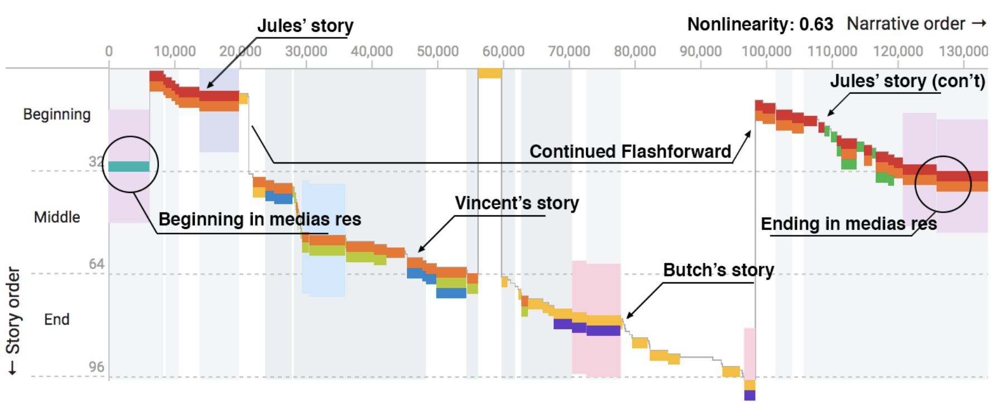
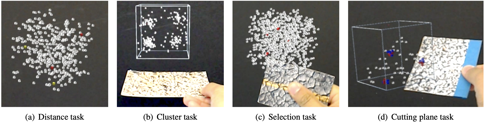
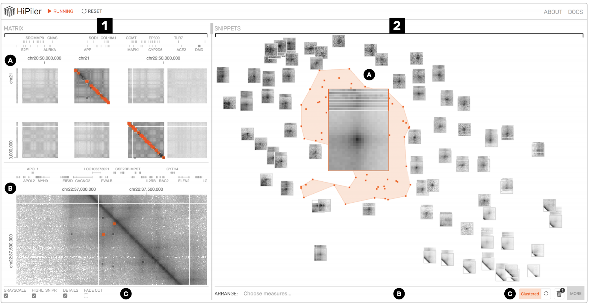

# Publications

## 2020

**[Pattern-Driven Navigation in 2D Multiscale Visualizations with Scalable Insets](https://vcg.seas.harvard.edu/publications/pattern-driven-navigation-in-2d-multiscale-visualizations-with-scalable-insets)**
Fritz Lekschas, Michael Behrisch, Benjamin Bach, Peter Kerpedjiev, Nils Gehlenborg, Hanspeter Pfister, *IEEE Transactions on Visualization and Computer Graphics (TVCG) 2020 (IEEE VIS, 2019))*  

## 2019

**[Geographic Network Visualization Techniques: A Work-In-Progress Taxonomy](https://www.google.com/url?q=https%3A%2F%2Fgeographic-networks.github.io%2Fabstract.pdf&sa=D&sntz=1&usg=AFQjCNE14-21ZgF1E9MSvOJI2LrMlgSNIg)**
Sarah Schöttler, Tobias Kauer, Benjamin Bach: *Poster at Graph Drawing, (2019)*

[Weblink](https://geographic-networks.github.io)

**[IATK: An Immersive Analytics Toolkit](https://hal-enac.archives-ouvertes.fr/hal-02288638/file/IATK_IEEE_VR.pdf)**
Maxime Cordeil, Andrew Cunningham, Benjamin Bach, Christophe Hurter, Bruce H. Thomas, Kim Mariott, Tim Dwyer, IEEE VR (2019)  

[Weblink](https://research.monash.edu/en/publications/iatk-an-immersive-analytics-toolkit)

**[PaxVis: Visualizing Peace Agreements](papers/havens2019paxvis.pdf)**
Lucy Havens, Mengting Bao, Larissa Pschetz, Benjamin Bach, Christine Bell. 
*ACM Conference on Human Factors in Computing Systems (CHI) (2019).*

[Weblink](https://sarah37.github.io/pax/timeandspace)

**[Comparing Effectiveness and Engagement of Data Comics and Infographics](https://www.researchgate.net/profile/Benjamin_Bach2/publication/331357753_Comparing_Effectiveness_and_Engagement_of_Data_Comics_and_Infographics/links/5cb859aaa6fdcc1d499cc3b1/Comparing-Effectiveness-and-Engagement-of-Data-Comics-and-Infographics.pdf)**
Zezong Wang, Shunming Wang, Matteo Farinella, Dave Murray-Rust, Nathalie Henry Riche.  *ACM Conference on Human Factors in Computing Systems (CHI)  (2019).*

**[DataToon: Drawing Data Comics About DynamicNetworks with Pen + Touch Interaction](https://www.researchgate.net/profile/Benjamin_Bach2/publication/332231214_DataToon_Drawing_Data_Comics_About_Dynamic_Networks_with_Pen_Touch_Interaction/links/5ca78456299bf118c4b57dd7/DataToon-Drawing-Data-Comics-About-Dynamic-Networks-with-Pen-Touch-Interaction.pdf)**
Nam Wook Kim, Nathalie Henry Riche, Benjamin Bach, Guanpeng Xu, Matthew Brehmer, Ken Hinckley, Michel Pahud, Haijun Xia, Michael J. McGuffin, Hanspeter Pfister. *ACM Conference on Human Factors in Computing Systems (CHI) (2019).*

**[Teaching Data Visualization and Storytelling with Data Comic Workshops](papers/wang2019teaching.pdf)**
Zezhong Wang, Harvey Dingwal, Benjamin Bach.  ACM Conference on Human Factors in Computing Systems (CHI), Extended Abstracts (2019).

**[DXR: A Toolkit for Building Immersive Data Visualizations](papers/sicat2019dxr.pdf)**
Sicat, Ronell, Jiabao Li, JunYoung Choi, Maxime Cordeil, Won-Ki Jeong, Benjamin Bach, and Hanspeter Pfister. *IEEE transactions on visualization and computer graphics (2019) (IEEE VIS 2018).*

## 2018

**[Multisensory immersive analytics](https://research.bangor.ac.uk/portal/files/22078708/immersiveAnalyticsRobertsChapter.pdf)**
McCormack, Jon, Jonathan C. Roberts, Benjamin Bach, Carla Dal Sasso Freitas, Takayuki Itoh, Christophe Hurter, and Kim Marriott. *In Immersive Analytics, pp. 57-94. Springer, Cham, 2018.*

**[Information Visualization Evaluation Using Crowdsourcing](https://www.microsoft.com/en-us/research/uploads/prod/2018/05/InfoVis-Crowdsourcing-CGF2018.pdf)**
Borgo, Rita, L. Micallef, B. Bach, F. McGee, and B. Lee. *n Computer Graphics Forum, vol. 37, no. 3, pp. 573-595. 2018.*

**[Ways of Visualizing Data on Curves](https://hal.inria.fr/hal-01818137/document)**
Bach, Benjamin, Charles Perin, Qiuyuan Ren, and Pierre Dragicevic. *In TransImage 2018-5th Biennial Transdisciplinary Imaging Conference, pp. 1-14. 2018.*

[Weblink](https://dataoncurves.wordpress.com)

**[Narrative Design Patterns for Data-Driven Storytelling](https://www.taylorfrancis.com/books/e/9781315281575/chapters/10.1201/9781315281575-5)**
Bach, Benjamin, Moritz Stefaner, Jeremy Boy, Steven Drucker, Lyn Bartram, Jo Wood, Paolo Ciuccarelli, Yuri Engelhardt, Ulrike Koeppen, and Barbara Tversky. *In Data-Driven Storytelling, pp. 125-152. AK Peters/CRC Press, 2018.*

**[VisGuides: A forum for discussing visualization guidelines](https://www.google.com/url?q=https%3A%2F%2Fdl.acm.org%2Fcitation.cfm%3Fid%3D3290790&sa=D&sntz=1&usg=AFQjCNFLFC4DdPLHXPvRvLEGVnZsjCIrrg)**
Diehl, Alexandra, Alfie Abdul-Rahman, Mennatallah El-Assady, Benjamin Bach, Daniel Keim, and Min Chen. IEEE/CGD EuroVis Shortpapers (2018).

**[Towards Open-World Scenarios: Teaching the Social Side of Data Science](https://www.research.ed.ac.uk/portal/files/55614371/Corneili2018towards.pdf)**
Corneli, Joseph, Dave Murray-Rust, and Benjamin Bach. *In Proceedings of Cybernetic Serendipity Reimagined Symposium, Proc. Annual Convention of the Society for the Study of Artificial Intelligence and Simulation of Behaviour. AISB 2018.*

**[Picturing Science: Design Patterns in Graphical Abstracts](https://www.google.com/url?q=https%3A%2F%2Faviz.fr%2F~bbach%2Fpapers%2FHullman2018graphical.pdf&sa=D&sntz=1&usg=AFQjCNFYn4DvM-jmQBOUUn58VqoKHncpPA)**
Hullman, Jessica, and Benjamin Bach. *International Conference on Theory and Application of Diagrams. Springer, Cham, 2018.*

**[Animated Edge Textures in Node-Link Diagrams: a Design Space and Initial Evaluation](https://hal.inria.fr/hal-01726358/document)**
Romat, Hugo, Caroline Appert, Benjamin Bach, Nathalie Henry-Riche, and Emmanuel Pietriga. *In Proceedings of the 2018 CHI Conference on Human Factors in Computing Systems, p. 187. ACM, 2018.*

**[Design patterns for data comics](https://www.research.ed.ac.uk/portal/files/57948259/Bach2018designpatterns.pdf)**
Bach, Benjamin, Zezhong Wang, Matteo Farinella, Dave Murray-Rust, and Nathalie Henry Riche. In *Proceedings of the 2018 CHI Conference on Human Factors in Computing Systems, p. 38. ACM, 2018.*

**[Visualizing Nonlinear Narratives with Story Curves](https://www.research.ed.ac.uk/portal/files/45220909/h)**
Kim, Nam Wook, Benjamin Bach, Hyejin Im, Sasha Schriber, Markus Gross, and Hanspeter Pfister. *IEEE Transactions on Visualization & Computer Graphics 1 (2018): 1-1.*

**[The Hologram in My Hand: How Effective is Interactive Exploration of 3D Visualizations in Immersive Tangible Augmented Reality?](https://vcg.seas.harvard.edu/publications/the-hologram-in-my-hand-how-effective-is-interactive-exploration-of-3d-visualizations-in-immersive-tangible-augmented-reality/paper)**
Bach, Benjamin, Ronell Sicat, Johanna Beyer, Maxime Cordeil, and Hanspeter Pfister. *IEEE Transactions on Visualization & Computer Graphics 1 (2018): 1-1.*

**[HiPiler: visual exploration of large genome interaction matrices with interactive small multiples](https://core.ac.uk/download/pdf/151396055.pdf)**
Lekschas, Fritz, Benjamin Bach, Peter Kerpedjiev, Nils Gehlenborg, and Hanspeter Pfister. *IEEE transactions on visualization and computer graphics 24, no. 1 (2018): 522-531.*
