[2020](#2020) | [2019](#2019) |  [2018](#2018) |  [2017](#2017) |  [2016](#2016) |  [2015](#2015) |  [2014](#2014) |  [2013](#2013)

# Publications

## 2020

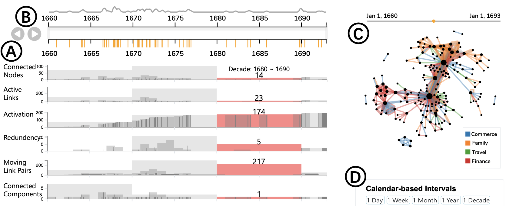
**[Interactive Time-Series of Measures for Exploring Dynamic Networks](papers/Xie2020measureflow.pdf)**:
Liwenhan Xie, James O'Donnel, Benjamin Bach, Jean-Daniel Fekete
*International Confernce on Advances Interfaces (AVI) (2020).*

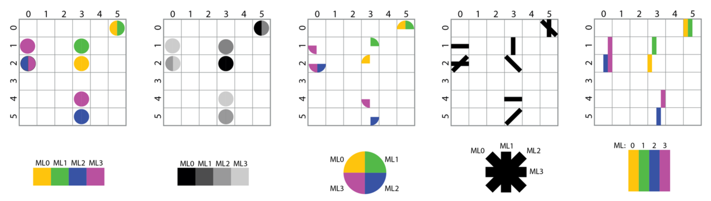
**[Visual Encodings for Networks with Multiple Edge Types](papers/Vogogias2020visual.pdf)**:
Athanasios Vogogias, Daniel Archambault, Benjamin Bach, Jessie Kennedy
*International Confernce on Advances Interfaces (AVI) (2020).*

**[Cheat Sheets for Data Visualization Techniques](papers/wang2020cheat.pdf)**:
Zezhong Wang, Lovisa Sundin, Dave Murray-Rust, Benjamin Bach
*ACM Conference on Human Factors in Computing Systems (CHI) (2020).*

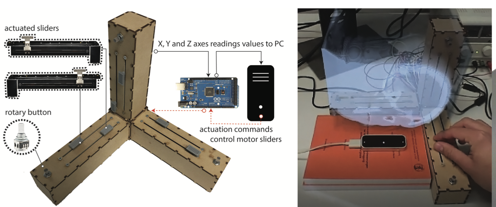
**[Embodied Axes: Tangible, Actuated Interaction for 3D Augmented Reality Data Spaces](papers/cordeil2020embodied.pdf)**:
Maxime Cordeil, Benjamin Bach, Andrew Cunningham, Bastian Montoya, Ross T. Smith, Bruce H. Thomas, Tim Dwyer
*ACM Conference on Human Factors in Computing Systems (CHI) (2020).*

**[DoughNets: Visualising Networks Using Torus Wrapping](papers/chen2020doughnets.pdf)**:
Kun-Ting Chen, Tim Dwyer, Kim Marriott, Benjamin Bach
*ACM Conference on Human Factors in Computing Systems (CHI) (2020).*

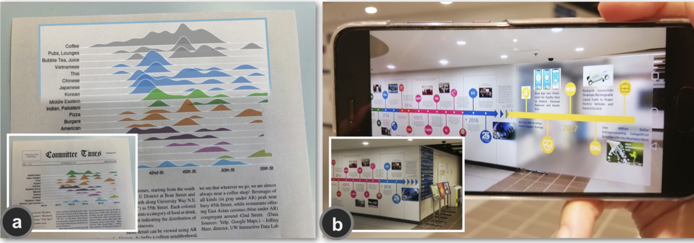
**[Augmenting Static Visualizations with PapARVis Designer](papers/chen2020augmenting.pdf)**:
Zhutian Chen, Wai Tong, Qianwen Wang, Benjamin Bach, Huamin Qu
*ACM Conference on Human Factors in Computing Systems (CHI) (2020).*

**[Pattern-Driven Navigation in 2D Multiscale Visualizations with Scalable Insets](https://vcg.seas.harvard.edu/publications/pattern-driven-navigation-in-2d-multiscale-visualizations-with-scalable-insets)**:
Fritz Lekschas, Michael Behrisch, Benjamin Bach, Peter Kerpedjiev, Nils Gehlenborg, Hanspeter Pfister, *IEEE Transactions on Visualization and Computer Graphics (TVCG) 2020 (IEEE VIS, 2019))*  

## 2019

**[Geographic Network Visualization Techniques: A Work-In-Progress Taxonomy](https://www.google.com/url?q=https%3A%2F%2Fgeographic-networks.github.io%2Fabstract.pdf&sa=D&sntz=1&usg=AFQjCNE14-21ZgF1E9MSvOJI2LrMlgSNIg)**:
Sarah Schöttler, Tobias Kauer, Benjamin Bach: *Poster at Graph Drawing, (2019)*

[Weblink](https://geographic-networks.github.io)

**[IATK: An Immersive Analytics Toolkit](https://hal-enac.archives-ouvertes.fr/hal-02288638/file/IATK_IEEE_VR.pdf)**:
Maxime Cordeil, Andrew Cunningham, Benjamin Bach, Christophe Hurter, Bruce H. Thomas, Kim Mariott, Tim Dwyer, IEEE VR (2019)  

[Weblink](https://research.monash.edu/en/publications/iatk-an-immersive-analytics-toolkit)

**[PaxVis: Visualizing Peace Agreements](papers/havens2019paxvis.pdf)**:
Lucy Havens, Mengting Bao, Larissa Pschetz, Benjamin Bach, Christine Bell. 
*ACM Conference on Human Factors in Computing Systems (CHI) (2019).*

[Weblink](https://sarah37.github.io/pax/timeandspace)

**[Comparing Effectiveness and Engagement of Data Comics and Infographics](https://www.researchgate.net/profile/Benjamin_Bach2/publication/331357753_Comparing_Effectiveness_and_Engagement_of_Data_Comics_and_Infographics/links/5cb859aaa6fdcc1d499cc3b1/Comparing-Effectiveness-and-Engagement-of-Data-Comics-and-Infographics.pdf)**:
Zezong Wang, Shunming Wang, Matteo Farinella, Dave Murray-Rust, Nathalie Henry Riche.  *ACM Conference on Human Factors in Computing Systems (CHI)  (2019).*

**[DataToon: Drawing Data Comics About DynamicNetworks with Pen + Touch Interaction](https://www.researchgate.net/profile/Benjamin_Bach2/publication/332231214_DataToon_Drawing_Data_Comics_About_Dynamic_Networks_with_Pen_Touch_Interaction/links/5ca78456299bf118c4b57dd7/DataToon-Drawing-Data-Comics-About-Dynamic-Networks-with-Pen-Touch-Interaction.pdf)**:
Nam Wook Kim, Nathalie Henry Riche, Benjamin Bach, Guanpeng Xu, Matthew Brehmer, Ken Hinckley, Michel Pahud, Haijun Xia, Michael J. McGuffin, Hanspeter Pfister. *ACM Conference on Human Factors in Computing Systems (CHI) (2019).*

**[Teaching Data Visualization and Storytelling with Data Comic Workshops](papers/wang2019teaching.pdf)**
Zezhong Wang, Harvey Dingwal, Benjamin Bach.  ACM Conference on Human Factors in Computing Systems (CHI), Extended Abstracts (2019).

**[DXR: A Toolkit for Building Immersive Data Visualizations](papers/sicat2019dxr.pdf)**
Sicat, Ronell, Jiabao Li, JunYoung Choi, Maxime Cordeil, Won-Ki Jeong, Benjamin Bach, and Hanspeter Pfister. *IEEE transactions on visualization and computer graphics (2019) (IEEE VIS 2018).*

## 2018

**[Multisensory immersive analytics](https://research.bangor.ac.uk/portal/files/22078708/immersiveAnalyticsRobertsChapter.pdf)**
McCormack, Jon, Jonathan C. Roberts, Benjamin Bach, Carla Dal Sasso Freitas, Takayuki Itoh, Christophe Hurter, and Kim Marriott. *In Immersive Analytics, pp. 57-94. Springer, Cham, 2018.*

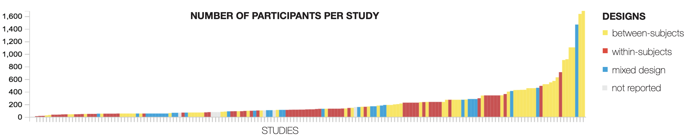
**[Information Visualization Evaluation Using Crowdsourcing](https://www.microsoft.com/en-us/research/uploads/prod/2018/05/InfoVis-Crowdsourcing-CGF2018.pdf)**
Borgo, Rita, L. Micallef, B. Bach, F. McGee, and B. Lee. *n Computer Graphics Forum, vol. 37, no. 3, pp. 573-595. 2018.*

**[Ways of Visualizing Data on Curves](https://hal.inria.fr/hal-01818137/document)**
Bach, Benjamin, Charles Perin, Qiuyuan Ren, and Pierre Dragicevic. *In TransImage 2018-5th Biennial Transdisciplinary Imaging Conference, pp. 1-14. 2018.*

[Weblink](https://dataoncurves.wordpress.com)

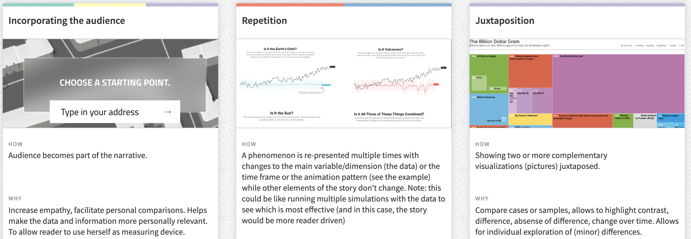
**[Narrative Design Patterns for Data-Driven Storytelling](https://www.taylorfrancis.com/books/e/9781315281575/chapters/10.1201/9781315281575-5)**
Bach, Benjamin, Moritz Stefaner, Jeremy Boy, Steven Drucker, Lyn Bartram, Jo Wood, Paolo Ciuccarelli, Yuri Engelhardt, Ulrike Koeppen, and Barbara Tversky. *In Data-Driven Storytelling, pp. 125-152. AK Peters/CRC Press, 2018.*

[Weblink](http://napa-cards.net)

**[VisGuides: A forum for discussing visualization guidelines](https://www.google.com/url?q=https%3A%2F%2Fdl.acm.org%2Fcitation.cfm%3Fid%3D3290790&sa=D&sntz=1&usg=AFQjCNFLFC4DdPLHXPvRvLEGVnZsjCIrrg)**
Diehl, Alexandra, Alfie Abdul-Rahman, Mennatallah El-Assady, Benjamin Bach, Daniel Keim, and Min Chen. IEEE/CGD EuroVis Shortpapers (2018).

**[Towards Open-World Scenarios: Teaching the Social Side of Data Science](https://www.research.ed.ac.uk/portal/files/55614371/Corneili2018towards.pdf)**
Corneli, Joseph, Dave Murray-Rust, and Benjamin Bach. *In Proceedings of Cybernetic Serendipity Reimagined Symposium, Proc. Annual Convention of the Society for the Study of Artificial Intelligence and Simulation of Behaviour. AISB 2018.*

**[Picturing Science: Design Patterns in Graphical Abstracts](https://www.google.com/url?q=https%3A%2F%2Faviz.fr%2F~bbach%2Fpapers%2FHullman2018graphical.pdf&sa=D&sntz=1&usg=AFQjCNFYn4DvM-jmQBOUUn58VqoKHncpPA)**
Hullman, Jessica, and Benjamin Bach. *International Conference on Theory and Application of Diagrams. Springer, Cham, 2018.*

**[Animated Edge Textures in Node-Link Diagrams: a Design Space and Initial Evaluation](https://hal.inria.fr/hal-01726358/document)**
Romat, Hugo, Caroline Appert, Benjamin Bach, Nathalie Henry-Riche, and Emmanuel Pietriga. *In Proceedings of the 2018 CHI Conference on Human Factors in Computing Systems, p. 187. ACM, 2018.*

**[Design patterns for data comics](https://www.research.ed.ac.uk/portal/files/57948259/Bach2018designpatterns.pdf)**
Bach, Benjamin, Zezhong Wang, Matteo Farinella, Dave Murray-Rust, and Nathalie Henry Riche. In *Proceedings of the 2018 CHI Conference on Human Factors in Computing Systems, p. 38. ACM, 2018.*

**[Visualizing Nonlinear Narratives with Story Curves](https://www.research.ed.ac.uk/portal/files/45220909/h)**
Kim, Nam Wook, Benjamin Bach, Hyejin Im, Sasha Schriber, Markus Gross, and Hanspeter Pfister. *IEEE Transactions on Visualization & Computer Graphics 1 (2018): 1-1.*

**[The Hologram in My Hand: How Effective is Interactive Exploration of 3D Visualizations in Immersive Tangible Augmented Reality?](https://vcg.seas.harvard.edu/publications/the-hologram-in-my-hand-how-effective-is-interactive-exploration-of-3d-visualizations-in-immersive-tangible-augmented-reality/paper)**
Bach, Benjamin, Ronell Sicat, Johanna Beyer, Maxime Cordeil, and Hanspeter Pfister. *IEEE Transactions on Visualization & Computer Graphics 1 (2018): 1-1.*

**[HiPiler: visual exploration of large genome interaction matrices with interactive small multiples](https://core.ac.uk/download/pdf/151396055.pdf)**
Lekschas, Fritz, Benjamin Bach, Peter Kerpedjiev, Nils Gehlenborg, and Hanspeter Pfister. *IEEE transactions on visualization and computer graphics 24, no. 1 (2018): 522-531.*

## 2017

**[Alignment Cubes: Towards Interactive Visual Exploration and Evaluation of Multiple Ontology Alignments](http://ceur-ws.org/Vol-1963/paper496.pdf)**
Valentina Ivanova, Benjamin Bach, Emmanual Pietriga, Pierre Lambrix
*International Semantic Web Conference, 400-417*

**[Understanding the Use of The Vistorian: Complementing Logs with Context Mini-Questionnaires](https://hal.inria.fr/hal-01650259/document)
Verena S. Molinero, Benjamin Bach, Catherine Plaisant, Nicole Dufournaud, Jean-Daniel Fekete
*Workshop on Visualization for the Digital Humanities IEEE VIS 2017*

**Crowdsourcing for Information Visualization: Promises and Pitfalls**
Rita Borgo, Bongshin Lee, Benjamin Bach, Sara Fabrikant, Radu Jianu, Andreas Kerren, Stephen Kobourov, Fintan McGee, Luana Micallef, Tatiana von Landesberger, Katrin Ballweg, Stephan Diehl, Paolo Simonetto, Michelle Zhou

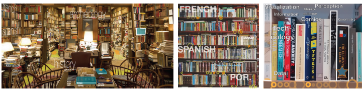
**[Drawing into the AR-CANVAS: Designing Embedded Visualizations for Augmented Reality](https://vcg.seas.harvard.edu/publications/drawing-into-the-ar-canvas-designing-embedded-visualizations-for-augmented-reality)**
Benjamin Bach, Ronell Sicat, Hanspeter Pfister, Aaron Quigley
IEEE VIS, Workshop on Immersive Analytics
Evaluation in the Crowd. Crowdsourcing and Human-Centered Experiments, 96-138

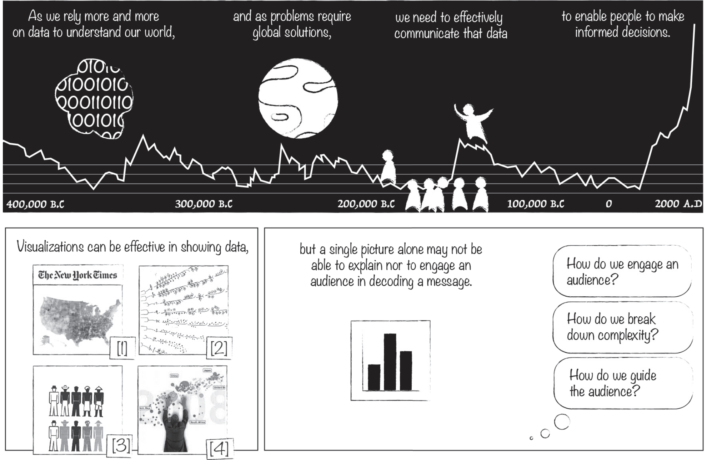
**[The Emerging Genre of Data Comics](https://www.researchgate.net/profile/Benjamin_Bach2/publication/316497056_The_Emerging_Genre_of_Data_Comics/links/5b22526ca6fdcc69745ee6a7/The-Emerging-Genre-of-Data-Comics.pdf)**
Benjamin Bach, Nathalie Henry Riche, Sheelagh Carpendale, Hanspeter Pfister
IEEE Computer Graphics and Applications 38 (3), 6-13

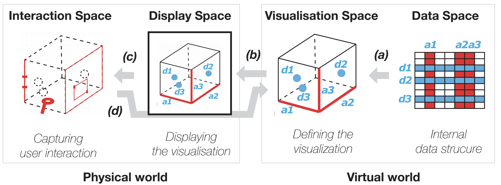
**[A Design Space for Spatio-Data Coordination: Tangible Interaction Devices for Immersive Information Visualisation]()**
Maxime Cordeil, Benjamin Bach, Yongchao Li, Elliott Willson, Tim Dwyer
Proceedings of IEEE Pacific Visualization Symposium (Pacific Vis)

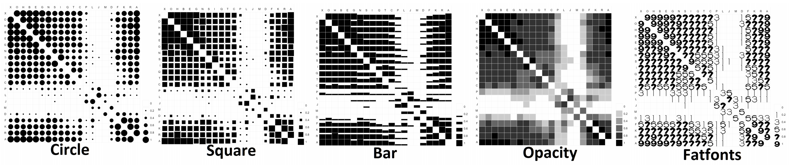
**[Evaluating Perceptually Complementary Views for Network Exploration Tasks](https://ialab.it.monash.edu/~dwyer/papers/proceedings_complementaryviews.pdf)**
Chungli Chang, Benjamin Bach, Tim Dwyer, Kim Marriott
ACM Conference on Human Factors in Information Systems (CHI)

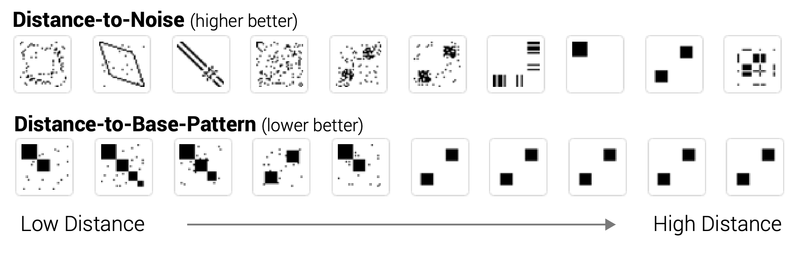
**[Magnostics: Image-based Search of Interesting Matrix Views for Guided Network Exploration](https://hal.inria.fr/hal-01377861/document)**
Michael Behrisch, Benjamin Bach, Michael Hund, Michael Delz, Laura von Rueden, Jean-Daniel Fekete, Tobias Scheck
IEEE Transactions on Visualization and Computer Graphics (TVCG)

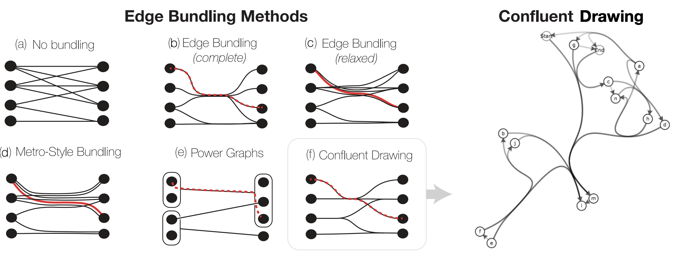
**[Towards Unambiguous Edge Bundling: Investigating Confluent Drawings for Network Visualization](https://aviz.fr/~bbach/confluentgraphs/Bach2016confluentgraphs.pdf)**
Benjamin Bach, Nathalie Henry Riche, Christophe Hurter, Kim Marriott, Tim Dwyer
IEEE Transactions on Visualization and Computer Graphics (TVCG)

[Weblink](https://aviz.fr/~bbach/confluentgraphs)

## 2016

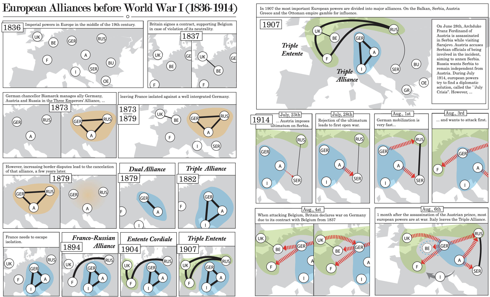
**[Telling Stories about Dynamic Networks with Graph Comics]](https://hal.inria.fr/hal-01256099/document)**
Benjamin Bach, Nathalie Kerracher, Kyle W. Hall, Sheelagh Carpendale, Jessie Kennedy, Nathalie Henry Riche
Proceedings of the Conference on Human Factors in Information Systems (CHI)

**[A Descriptive Framework for Temporal Data Visualizations Based on Generalized Space‐Time Cubes](https://hal-enac.archives-ouvertes.fr/hal-01303506/file/Bach2016spacetimecubes.pdf)**
Benjamin Bach, Pierre Dragicevic, Daniel Archambault, Christophe Hurter, Sheelagh Carpendale
Computer Graphics Forum

Unfolding Dynamic Networks for Visual Exploration
Benjamin Bach
IEEE Computer Graphics and Applications 36 (2), 74-82

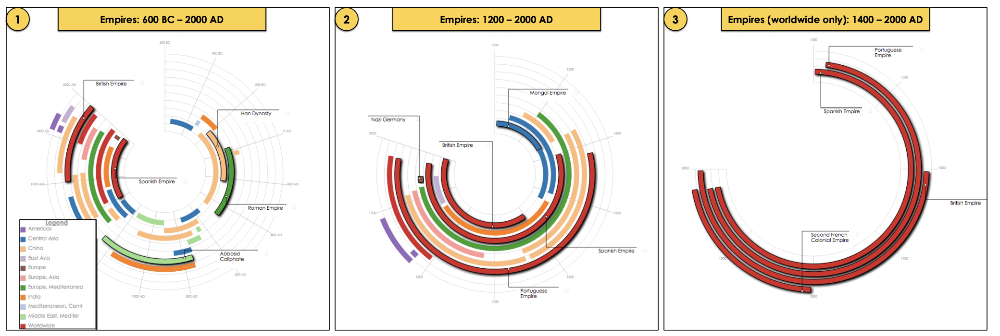
**[Timelines Revisited: A Design Space and Considerations for Expressive Storytelling](https://www.microsoft.com/en-us/research/wp-content/uploads/2016/10/Brehmer-TVCG-2017.pdf)**. Matthew Brehmer, Bongshin Lee, Benjamin Bach, Nathalie Henry Riche, Tamara Munzner. IEEE Transactions on Visualization and Computer Graphics (TVCG, Proceedings of InfoVis 2015)

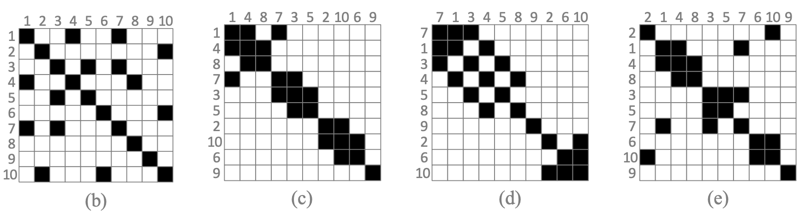
**[Matrix Reordering Methods for Table and Network Visualization](https://hal.inria.fr/hal-01326759/document)**
Michael Behrisch, Benjamin Bach, Nathalie Henry Riche, Tobias Schreck, Jean-Daniel Fekete
EuroVis (State-of-the-Art) 35 (3)

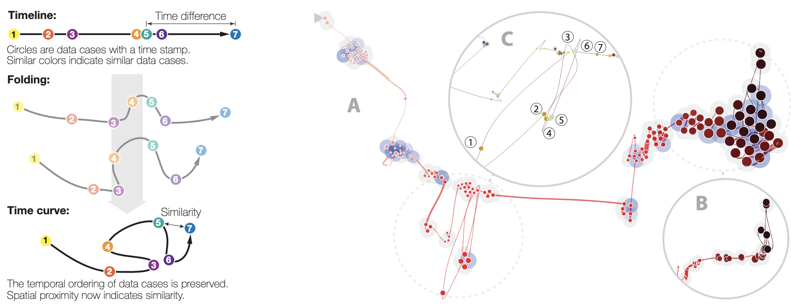
**[Time Curves: Folding Time to Visualize Patterns of Temporal Evolution in Data](https://aviz.fr/~bbach/timecurves/Bach2015timecurves.pdf)**
Benjamin Bach, Conglei Shi, Nicholas Heulot, Tara Madhyastha, Thomas Grabowski, Pierre Dragicevic
IEEE Transactions on Visualization and Computer Graphics (TCVG), 2016

## 2015

NetworkCube: Bringing Dynamic Network Visualizations to Domain Scientists
B Bach, NH Riche, R Fernandez, E Giannisakis, B Lee, JD Fekete
Proceedings of IEEE VIS Conference, posters

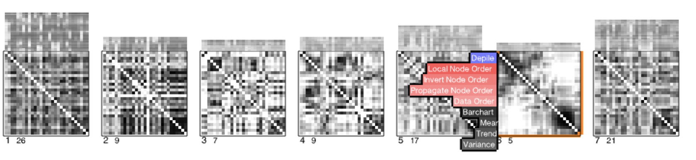
**[Small MultiPiles: Piling Time to Explore Temporal Patterns in Dynamic Networks](https://hal.inria.fr/hal-01158987/document)**
B Bach, N Henry Riche, T Dwyer, T Madhyastha, JD Fekete, T Grabowski
Eurographics Conference on Visualization (EuroVis)

[Weblink](https://aviz.fr/~bbach/multipiles)

Visual and Audio Monitoring of Island Based Parallel Evolutionary Algorithms
H Gilbert, W Cancino, B Bach, J Pallamidessi, P Parrend, P Collet
Journal of Grid Computing 3 (13), 309-327.(2015)

A Review of Temporal Data Visualizations Based on Space-Time Cube Operations
B Bach, P Dragicevic, D Archambault, C Hurter, S Carpendale
Eurographics Conference on Visualization

## 2014

**[Visualizing Dynamic Networks with Matrix Cubes](https://hal.inria.fr/hal-00931911v1/document)**
Benjamin Bach, Emmauel Pietriga, Jean-Daniel Fekete
Proceedings of the SIGCHI Conference on Human Factors in Computing Systems (CHI). 2014

GridVis: Visualisation of Island-Based Parallel Genetic Algorithms
L Evelyne, G Hugo, C Waldo, B Bach, P Pierre, C Pierre
Parallel Architectures and Distributed Infrastructures (EvoStar)

Gridvis: Visualisation of island-based parallel genetic algorithms
E Lutton, H Gilbert, W Cancino, B Bach, P Parrend, P Collet
European Conference on the Applications of Evolutionary Computation, 702-713

Visual and Audio Monitoring of Island Based Parallel Evolutionary Algorithms
E Lutton, H Gilbert, W Cancino, B Bach, J Pallamidessi, P Parrend, ...
Journal of Grid Computing, 1-19

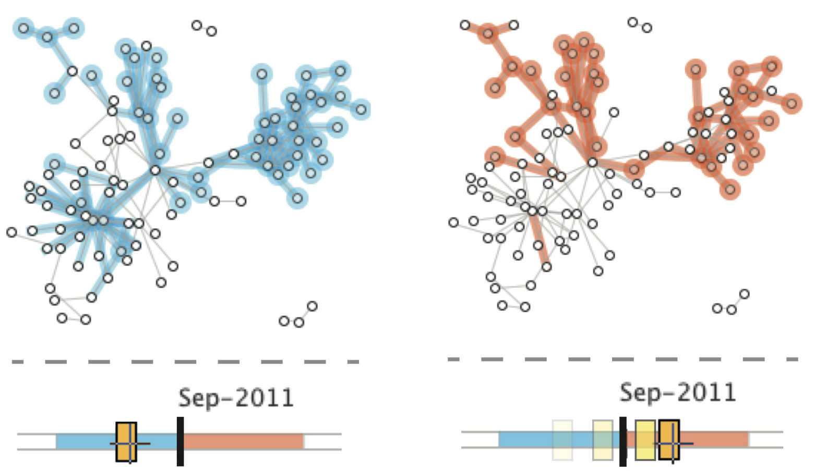
**[GraphDiaries: Animated Transitions and Temporal Navigation for Dynamic Networks](https://aviz.fr/~bbach/graphdiaries/Bach2013GraphDiaries.pdf)**
B Bach, E Pietriga, JD Fekete
Transactions on Visualization and Computer Graphics (TVCG), 1-1

## 2013

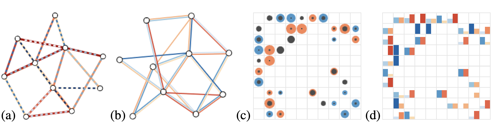
**[Weighted graph comparison techniques for brain connectivity analysis](https://hal.inria.fr/hal-00780999/document)**
B Alper, B Bach, N Henry Riche, T Isenberg, JD Fekete
Proceedings of the SIGCHI Conference on Human Factors in Computing Systems …
